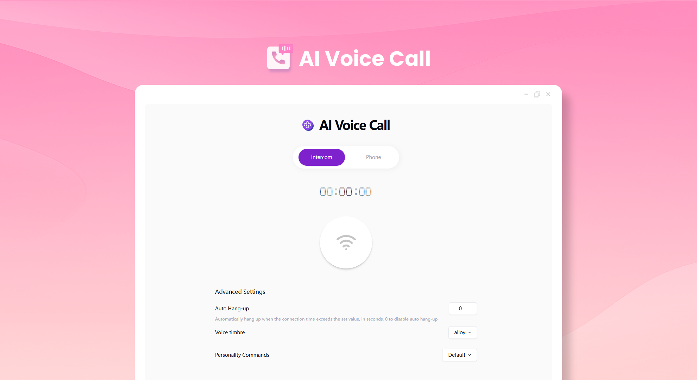
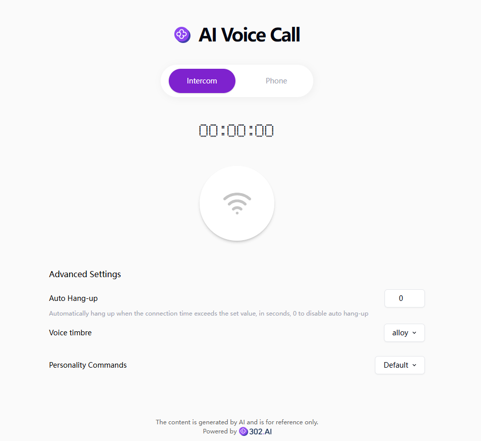

# 
🎙️ AI Voice Call 🚀✨

AI voice calls enable voice chatting with AI through a real-time voice interface. It supports walkie-talkie mode and telephone mode, and also allows users to customize the personality type of AI.

<a href="README_zh.md">中文</a> | <a href="README.md">English</a> | <a href="README_ja.md">日本語</a>

The open-source version of [AI Voice Call](https://302.ai/product/detail/44) from [302.AI](https://302.ai/en/).

You can directly log in to 302.AI and use the online version with zero code and zero configuration. Alternatively, modify this project according to your needs, input your 302.AI API KEY, and deploy it yourself.

## Interface Preview
It has two modes, namely walkie-talkie and telephone, and offers a variety of parameters that can be freely set.

## Project Features
### 📱 Voice Call Modes
You can choose the walkie-talkie mode or the telephone mode as needed.
### ⏰ Hang-up Time
You can set the hang-up time by yourself to save resources.
### 🎶 Voice Timbre and Personality Instructions
It supports multiple voice timbres and allows customizing personality instructions to adapt to the conversation scenarios.
### 🌓 Dark Mode
It supports the dark mode to protect your eyes.
### 🌍 Multi-language Support
- Chinese Interface
- English Interface
- Japanese Interface

Through AI Voice Call, anyone can have conversations with AI anytime, anywhere. 🎉🎙️ Let's explore the new world of AI-driven podcasts together! 🌟🚀

## 🚩 Future Update Plans 
- [ ] The coherence of multi-round conversations is enhanced
- [ ] The group call function is newly added

## Technology Stack

- Next.js 14
- Tailwind CSS
- Shadcn UI
- OpenAI Realtime

## Development & Deployment

1. Clone the project `git clone https://github.com/302ai/302_voice_call`
2. Install dependencies `pnpm install`
3. Configure the 302 API KEY with reference to .env.example
4. Run the project `pnpm dev`
5. Package and deploy `docker build -t realtime . && docker run -p 3000:3000 realtime`

## ✨ 302.AI Introduction ✨

[302.AI](https://302.ai) is an enterprise-oriented AI application platform that offers pay-as-you-go services, ready-to-use solutions, and an open-source ecosystem.✨
1. 🧠 It aggregates the latest and most comprehensive AI capabilities and brands, including but not limited to language models, image models, voice models, and video models.
2. 🚀 We develop real AI products, not just simple chatbots, through deep application development based on foundational models.
3. 💰 Zero monthly fees, with all functions paid on demand, fully open, achieving truly low thresholds and high ceilings.
4. 🛠 Powerful management backend for teams and small-to-medium enterprises, allowing one person to manage and multiple people to use.
5. 🔗 All AI capabilities provide API access, and all tools are open-source for customization (in progress).
6. 💡 Strong development team, launching 2-3 new applications weekly, with daily product updates. Developers interested in joining are also welcome to contact us.
