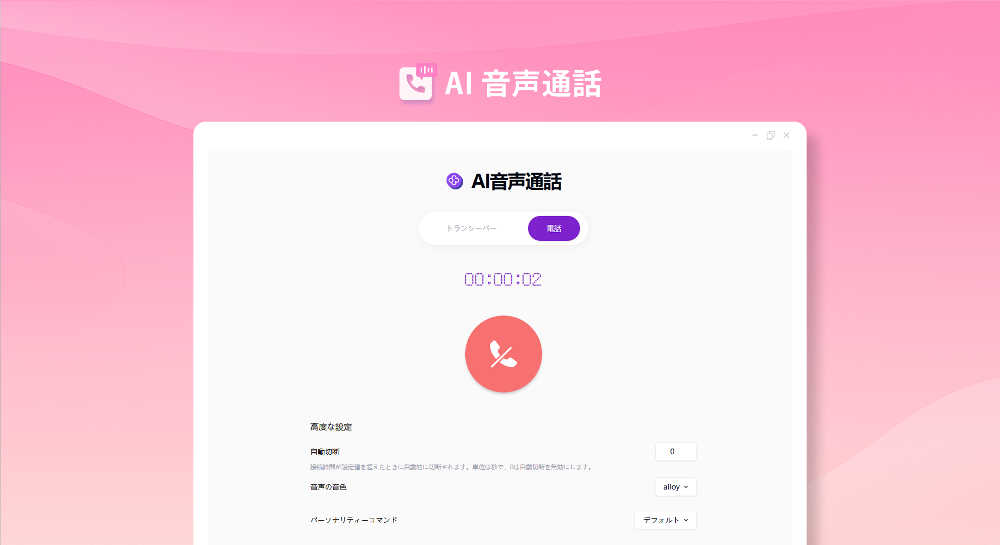
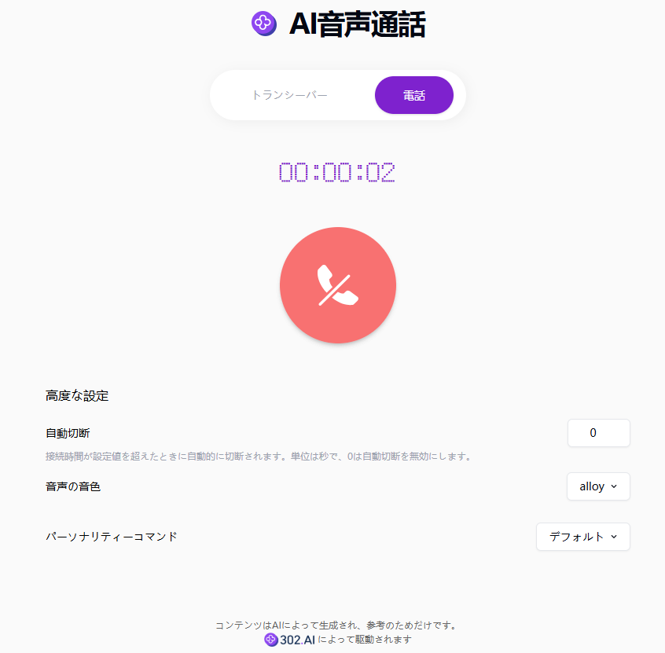

# 
🎙️ AI ボイスコール 🚀✨

AI 音声通話は、リアルタイム音声インターフェースを通じて AI と音声チャットを行うことができます。対講機モードと電話モードをサポートしており、AI の人格タイプをカスタマイズすることもできます。

<a href="README_zh.md">中文</a> | <a href="README.md">English</a> | <a href="README_ja.md">日本語</a>

[302.AI](https://302.ai)からの[AIボイスコール](https://302.ai/ja/tools/realtime/)のオープンソース版です。
302.AIに直接ログインして、コードも設定もなくオンライン版を使用できます。または、このプロジェクトを自分のニーズに合わせて修正し、302.AIのAPI KEYを入力して、自分でデプロイすることもできます。

## インターフェースプレビュー
それは、無線機と電話の 2 つのモードを備えており、自由に設定できる多様なパラメータを提供しています。

## プロジェクト特徴
### 📱 音声通話モード
必要に応じて対講機モードまたは電話モードを選択できます。
### ⏰ 切断時間
自ら切断時間を設定でき、資源を節約できます。
### 🎶 音声音色と人格指示
複数の音声音色をサポートし、カスタム人格指示をサポートしており、会話シーンに適応できます。
### 🌓 ダークモード
ダークモードをサポートし、あなたの目を保護します。
### 🌍 多言語サポート
- 中国語インターフェース
- 英語インターフェース
- 日本語インターフェース

AIボイスコールを通じて、誰でもいつでもどこでもAIと会話できます 🎉🎙️ 一緒にAI駆動のポッドキャストの新世界を探検しましょう! 🌟🚀

## 🚩 将来のアップデート計画
- [ ] マルチラウンド会話の連続性が強化されました
- [ ] グループ通話機能が新たに追加されました

## 技術スタック

- Next.js 14
- Tailwind CSS
- Shadcn UI
- OpenAI Realtime

## 開発とデプロイ

1. プロジェクトをクローン `git clone https://github.com/302ai/302_voice_call`
2. 依存関係をインストール `pnpm install`
3. 302のAPI KEYを構成 .env.exampleを参照
4. プロジェクトを実行 `pnpm dev`
5. パッケージングとデプロイ `docker build -t realtime . && docker run -p 3000:3000 realtime`

## ✨ 302.AI紹介 ✨

[302.AI](https://302.ai)は企業向けのAIアプリケーションプラットフォームであり、必要に応じて支払い、すぐに使用できるオープンソースのエコシステムです。✨

1. 🧠 最新かつ最も包括的なAI機能とブランドを集め、言語モデル、画像モデル、音声モデル、ビデオモデルなどを含み、これらに限定されません。
2. 🚀 基礎モデルに基づいて深度アプリケーション開発を行い、単純なチャットボットではなく、真のAI製品を開発しています。
3. 💰 月額料金は0で、すべての機能はオンデマンドで有料、全面的にオープンで、本当の意味で敷居が低く、上限が高いです。
4. 🛠 チームと中小企業向けの強力な管理バックエンドで、1人で管理し、複数人で使用できます。
5. 🔗 すべてのAI機能にAPIアクセスが提供され、すべてのツールはオープンソースでカスタマイズ可能（進行中）。
6. 💡 強力な開発チームで、毎週2-3個の新アプリをリリースし、製品は毎日更新されます。参加に興味がある開発者もお気軽にお問い合わせください。
