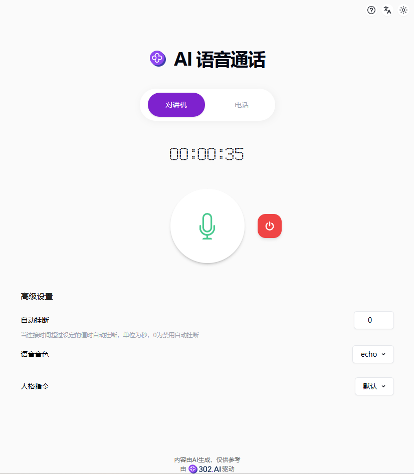
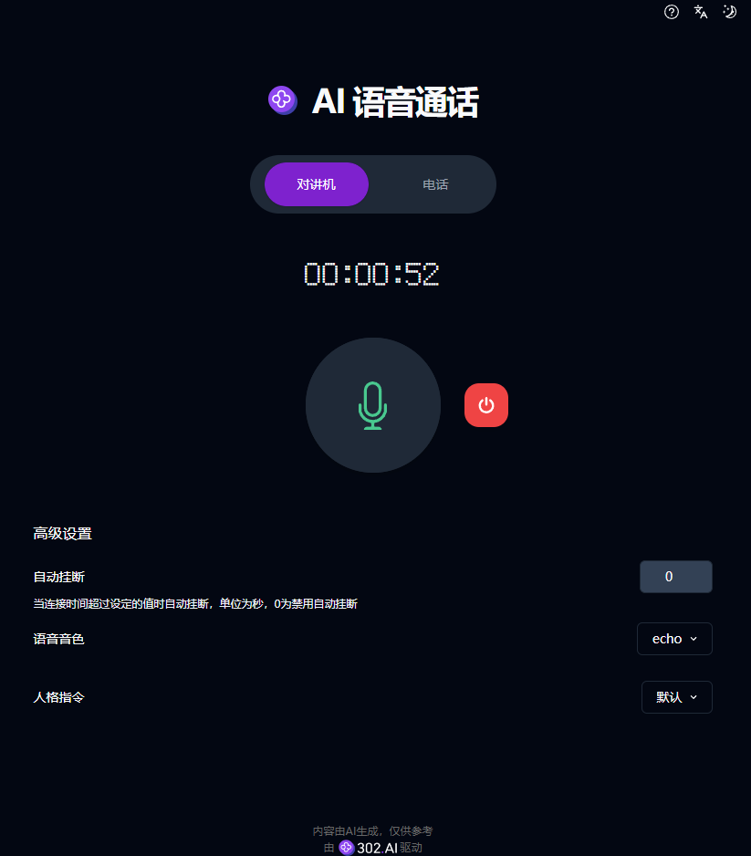
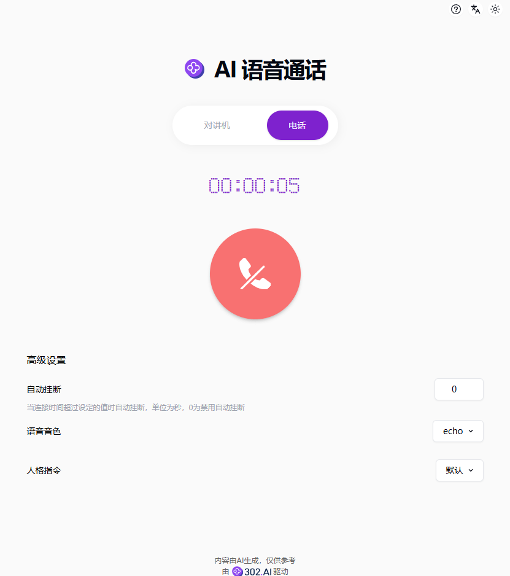
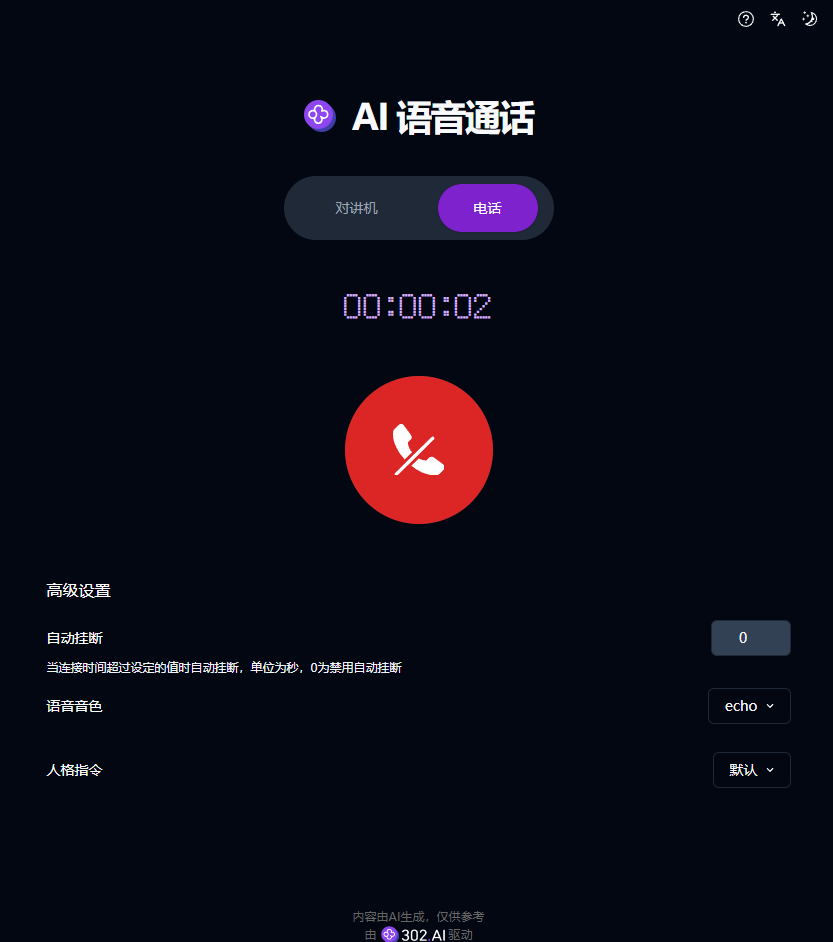

# 🎙️🤖 302.AIのAIボイスコールへようこそ! 🚀✨

[中文](README_zh.md) | [English](README.md) | [日本語](README_ja.md)

[302.AI](https://302.ai)からの[AIボイスコール](https://302.ai/tools/realtime/)のオープンソース版です。

302.AIに直接ログインして、コードも設定もなくオンライン版を使用できます。または、このプロジェクトを自分のニーズに合わせて修正し、302.AIのAPI KEYを入力して、自分でデプロイすることもできます。

## ✨ 302.AI紹介 ✨

[302.AI](https://302.ai)は、ユーザーがAIを実践に活用する最後の1マイルの問題を解決するオンデマンドのAIアプリケーションプラットフォームです。

1. 🧠 最新かつ最も包括的なAI機能とブランドを集め、言語モデル、画像モデル、音声モデル、ビデオモデルなどを含み、これらに限定されません。
2. 🚀 基礎モデルに基づいて深度アプリケーション開発を行い、単純なチャットボットではなく、真のAI製品を開発しています。
3. 💰 月額料金は0で、すべての機能はオンデマンドで有料、全面的にオープンで、本当の意味で敷居が低く、上限が高いです。
4. 🛠 チームと中小企業向けの強力な管理バックエンドで、1人で管理し、複数人で使用できます。
5. 🔗 すべてのAI機能にAPIアクセスが提供され、すべてのツールはオープンソースでカスタマイズ可能（進行中）。
6. 💡 強力な開発チームで、毎週2-3個の新アプリをリリースし、製品は毎日更新されます。参加に興味がある開発者もお気軽にお問い合わせください。

## プロジェクト特徴

1. 📱 インターコムと電話モード：ニーズに応じて選択できます。
2. ⏰ カスタムハングアップ時間：リソースを節約します。
3. 🎶 音声トーンとパーソナリティコマンド：複数の音声トーンをサポートし、カスタムパーソナリティコマンドをサポートし、対話シーンに適合します。
4. 🌓 ダークモード：ダークモードをサポートし、目を保護します。
5. 🌐 国際化：複数言語をサポートし、現在は中国語、英語、日本語をサポートしています。

AIボイスコールを通じて、誰でもいつでもどこでもAIと会話できます 🎉🎙️ 一緒にAI駆動のポッドキャストの新世界を探検しましょう! 🌟🚀

## 技術スタック

- Next.js 14
- Tailwind CSS
- Shadcn UI
- OpenAI Realtime

## 開発とデプロイ

1. プロジェクトをクローン `git clone https://github.com/302ai/pub_realtime`
2. 依存関係をインストール `pnpm install`
3. 302のAPI KEYを構成 .env.exampleを参照
4. プロジェクトを実行 `pnpm dev`
5. パッケージングとデプロイ `docker build -t realtime . && docker run -p 3000:3000 realtime`

## インターフェースプレビュー

### 1. インターコム

### 2. 電話

