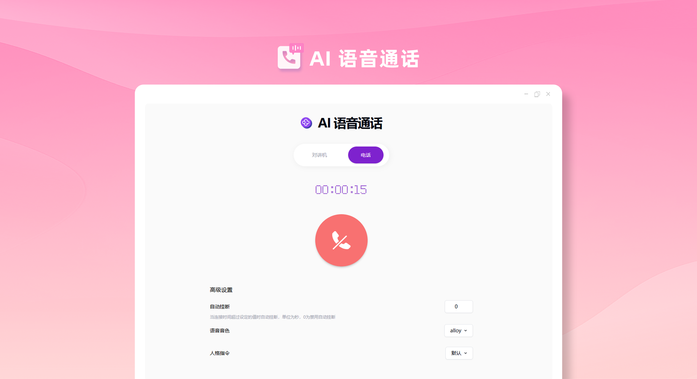

# 
🎙️AI 语音通话 🚀✨

AI语音通话通过实时语音接口与AI进行语音聊天，支持对讲机模式和电话模式，还可以自定义AI的人格类型。

<a href="README_zh.md">中文</a> | <a href="README.md">English</a> | <a href="README_ja.md">日本語</a>

来自[302.AI](https://302.ai)的[AI语音通话](https://302.ai/tools/realtime/)的开源版本。
你可以直接登录302.AI，零代码零配置使用在线版本。
或者对本项目根据自己的需求进行修改，传入302.AI的API KEY，自行部署。

## 界面预览
分对讲机和电话两种模式，提供多种参数自由设定。

## 项目特性
### 📱语音通话模式
  可根据需要选择对讲机或电话模式。
### ⏰ 挂断时间
  可自行设定挂断的时间，节约资源。
### 🎶 音色与人格指令
  支持多种音色，支持自定义人格指令，适配对话场景。
### 🌓 暗色模式
  支持暗色模式，保护您的眼睛。
### 🌍 多语言支持
  - 中文界面
  - English Interface
  - 日本語インターフェース

通过AI语音通话,任何人都可以随时随地与AI对话 🎉🎙️ 让我们一起探索AI驱动的播客新世界吧! 🌟🚀

## 🚩 未来更新计划
- [ ] 多轮对话连贯性增强
- [ ] 新增群组通话功能

## 技术栈
- Next.js 14
- Tailwind CSS
- Shadcn UI
- OpenAI Realtime

## 开发&部署
1. 克隆项目 `git clone https://github.com/302ai/302_voice_call`
2. 安装依赖 `pnpm install`
3. 配置302的API KEY 参考.env.example
4. 运行项目 `pnpm dev`
5. 打包部署 `docker build -t realtime . && docker run -p 3000:3000 realtime`

## ✨ 302.AI介绍 ✨
[302.AI](https://302.ai)是一个按需付费的AI应用平台，为用户解决AI用于实践的最后一公里问题。
1. 🧠 集合了最新最全的AI能力和品牌，包括但不限于语言模型、图像模型、声音模型、视频模型。
2. 🚀 在基础模型上进行深度应用开发，我们开发真正的AI产品，而不是简单的对话机器人
3. 💰 零月费，所有功能按需付费，全面开放，做到真正的门槛低，上限高。
4. 🛠 功能强大的管理后台，面向团队和中小企业，一人管理，多人使用。
5. 🔗 所有AI能力均提供API接入，所有工具开源可自行定制（进行中）。
6. 💡 强大的开发团队，每周推出2-3个新应用，产品每日更新。有兴趣加入的开发者也欢迎联系我们
